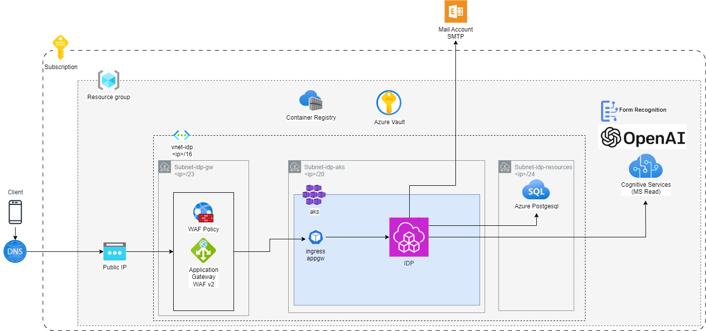

# Terraform repository for Azure infrastructure for COGNAiO® Cloud Extract
This repository serves as an example of how the infrastructure component for the COGNAiO® Cloud Extract can be set up.

COGNAiO cloud extract is a cloud native application and can be installed via [HelmCharts](https://github.com/dti-cognaio/cognaio-cloud-extract-helm). The application requires a postgreSQL and various OpenAi components from Azure. The mandatory resources are marked (*) below in the detailed description. All other infrastructure components can be customized as needed, as long as the application has the connections to the mentioned resources. Feel free to:
- deploy COGNAiO® Cloud Extract without application gateway. 
- Customize the Ip-Ranges. 
- Customize the SKU tiers to your needs etc.
- Scale the AKS cluster to your needs
- etc.

## Prerequisites
### Tools & Skills
- [Install Terraform](https://developer.hashicorp.com/terraform/tutorials/aws-get-started/install-cli)
- [Install Azure CLI Tool](https://learn.microsoft.com/en-us/cli/azure/install-azure-cli)
- Basic knowledge of Terraform
- Knowledge of productive application deployments in Azure
- Subscription in an Azure Tenant
  - Your Azure account must have a Cognitive Services Contributor role assigned in order for you to agree to the responsible AI terms and create a resource. To get this role assigned to your account, follow the steps in the [Assign roles](https://learn.microsoft.com/en-us/azure/role-based-access-control/role-assignments-steps) documentation, or contact your administrator.
- Make sure you full fill the following requirements from this [article](https://learn.microsoft.com/en-us/azure/ai-services/openai/how-to/create-resource?pivots=web-portal)
  - You have completed the [Form](https://aka.ms/oai/access), submitted it and got access to OpenAi services.

### Permissions
- Permissions in Subscription to create other resources
- Service Principal for terraform see [Connect to Azure](#tutorial-connect-to-azure-subscription)

### Tutorial connect to Azure Subscription
[Connect to Azure](https://developer.hashicorp.com/terraform/tutorials/azure-get-started/azure-build)
- ```az login```
- ```az account set --subscription "<SUBSCRIPTION_ID or SUBSCRIPTION_NAME>"```
- Creates a service Principal with Contributor rights in the provided Subscription <br>
```az ad sp create-for-rbac --role="Contributor" --scopes="/subscriptions/<SUBSCRIPTION_ID>"```

## Description
The repository creates the following resources as shown in the picture, depending on which variables have been set:


### Subscription and Resource groups *
The Azure Subscription where all parts for the COGNAiO® Cloud Extract resources are hosted. They can be managed into resource groups.
### Public IP
Public IP who relates to the Application Gateway or directly to the Ingress-Controller of AKS if deployed without Application Gateway
### Application Gateway with WAF v2
This component is the central entry Point for all requests. For security reasons a WAF (Web Application Firewall) is included into this component. Allow only secure Ciphers.
### Azure Kubernetes Service (AKS)
The Kubernetes cluster Service of Azure where the application runs as parts of Pods. The Application deployment is separate and done with Helm. The AKS is deployed with a system node pool and a working node pool.
#### Tested Kubernetes versions:
- v1.32.x
- v1.31.x
- v1.30.x
- v1.29.x
- v1.28.x
- v1.27.x
- v1.26.x

### Azure PostgreSQL *
The Database for the persistance of the COGNAiO® Cloud Extract application with some additional extensions enabled.
#### Tested Postgres versions:
- v16.x
- v15.4
- v14.13
- v14.12

### OpenAI, Form Recognition, Cognitive Services *
This are all AI-Services needed for proper working of the COGNAiO® Cloud Extract application.
#### OpenAi Models
This deployment provides three openAi models. If other models where needed to fit your needs, feel free to deploy them
- text-embedding-3-large
- gpt-4.1
- gpt-4.1-mini
### Container Registry
Stores the Images needed for the COGNAiO® Cloud Extract application can be externally and is not Part of this deployment.
### Azure Vault
Stores all secrets and credentials needed for the COGNAiO® Cloud Extract application
### Mail Account (Not part of Terraform) *
Mail account for sending emails from the application to it's user. 
> \* This resources are required so that COGNAiO® Cloud Extract runs properly.

## Usage
 - Fulfill [prerequisits](#prerequisites)
 - Adjust all parameters according to your needs and fill in the variables accordingly.
    - run `terraform plan -var-file="test.tfvars"` to pass a variable file
    - only application relevant variables have been added, all others can be adjusted directly

### Variables

| Name                                        | Description                                                                      | Value                     |
| ------------------------------------------- | -------------------------------------------------------------------------------- | ------------------------- |
| `tenant_id`                                 | Azure tenant id                                                                  | `<YOUR-TENANT-ID>`        | 
| `subscription_id`                           | Azure subscription id                                                            | `<YOUR-SUBSCRIPTION-ID>`  |
| `resources_group_name`                      | the resource group name where all resources will be deployed                     | `ais-test-rg`             |
| `default_location`                          | default Azure location where resources will be placed                            | `switzerlandnorth`        |
| `openAi_location`                           | default Azure location where OpenAi resources will be placed                     | `swedencentral`           |
| `deploy_application_gateway`                | deploy an application gateway with waf                                           | `true`                    |
| `deploy_openai_services`                    | deploy all cognitive openAi services                                             | `true`                    |
| `deploy_postgresql`                         | deploy postgreSQL database                                                       | `true`                    |
| `deploy_aks`                                | deploy azure kubernetes service                                                  | `true`                    |
| `deploy_aks_separated_work_system_node_pool`| deploy azure kubernetes service for productive use with two separate nodepools   | `true`                    |
| `deploy_key_vault`                          | deploy key vault                                                                 | `true`                    |
| `deploy_container_registry`                 | deploy a container registry                                                      | `true`                    |
| `is_container_registry_internally`          | check if container registry is in the same subscription if not deployed directly | `true`                    |
| `container_registry_name`                   | the name of the container registry                                               | `ais-test-cr`             |
| `container_registry_resource_group_name`    | the resource group of the container registry                                     | `ais-test-rg`             |
| `psql_username`                             | postgreSQL username                                                              | `<SQL-USER>`              |
| `psql_password`                             | postgreSQL password                                                              | `<SQL-PASSWORD>`          |

## CheatSheet
Check all commands in terraform [tutorial](https://developer.hashicorp.com/terraform/tutorials) page
- ```terraform init``` Initialize first run after checkout
- ```terraform validate``` Validates if the terraform charts are semantic and logical correct
- ```terraform plan``` Shows all changes where will be applied when executing, like a dry run ```apply```
- ```terraform apply``` Applies all changes
- ```terraform frm``` Formats all files
- ```terraform destroy``` deletes the resources
